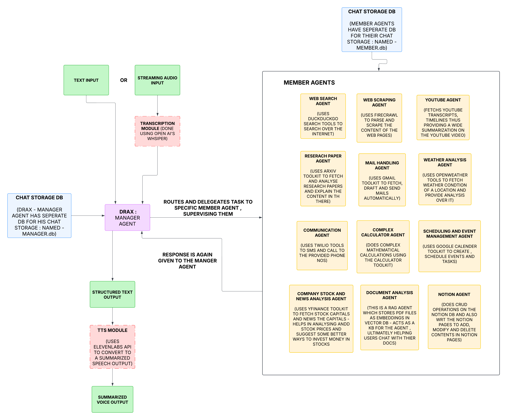

# DRAX ASSISTANT

DRAX is an intelligent AI assistant built using the `agno` framework. It leverages a multi-agent architecture where a central Manager agent delegates tasks to specialized Member agents, each equipped with specific tools and knowledge to handle diverse requests efficiently. DRAX supports text and voice input, provides text and spoken responses, and maintains persistent chat history across sessions.



## Overview

DRAX acts as a central coordinator (Manager) that understands user requests and routes them to the most appropriate expert agent within its team. This modular design allows for easy extension and specialization. The current team includes agents specialized in:

*   **Document Analysis:** Analyzing content from provided PDF documents using RAG.
*   **Web Search:** Performing web searches using DuckDuckGo.
*   **Stock Market:** Fetching stock market data via YFinance.
*   **Research Papers:** Searching for academic papers on Arxiv.
*   **Messaging:** Sending SMS/Calls via Twilio.
*   **Weather:** Getting weather forecasts using OpenWeatherMap.
*   **Web Scraping:** Scraping web content using Firecrawl.
*   **Email:** Managing emails via Gmail.
*   **Calculations:** Performing mathematical calculations.
*   **YouTube:** Interacting with YouTube (e.g., searching videos).
*   **GitHub:** Analyzing GitHub repositories via MCP.
*   **Notion:** Managing Notion databases and pages.
*   **Calendar:** Interacting with Google Calendar.

## Features

*   **Multi-Agent System:** Manager agent routes tasks to specialized member agents.
*   **Voice Interaction:** Record audio input (`/record`) transcribed via Groq API.
*   **Text-to-Speech (TTS):** Speak responses aloud (`/speak`) using ElevenLabs.
*   **Extensive Tool Integration:** Connects to numerous APIs and services (see Overview).
*   **RAG for Document Analysis:** Uses LanceDB and Gemini Embeddings to query PDF documents.
*   **Persistent Sessions:** Chat history is stored per session using SQLite (`SqliteAgentStorage`).
*   **Interactive CLI:** User-friendly command-line interface powered by `rich` and `typer`.
*   **Configuration Management:** Uses `.env` file for secure API key management.

## Technology Stack

*   **Core Framework:** [agno](https://github.com/AgenaAI/agno)
*   **LLM:** Google Gemini (`gemini-2.0-flash-exp`)
*   **Embeddings:** Google Gemini Embedder
*   **Vector DB:** LanceDB
*   **Storage:** SQLite
*   **Audio Recording:** Speech Recognition Library
*   **Transcription:** Groq API
*   **TTS:** ElevenLabs
*   **CLI:** `typer`, `rich`
*   **APIs/Tools:** See Overview section.
*   **Configuration:** `python-dotenv`

## Setup and Installation

1.  **Clone the Repository:**
    ```bash
    git clone <your-repository-url>
    cd DRAX_ASSISTANT
    ```

2.  **Create a Virtual Environment (Recommended):**
    ```bash
    python -m venv venv
    source venv/bin/activate  # On Windows use `venv\Scripts\activate`
    ```

3.  **Install Dependencies:**
    *(Ensure you have a `requirements.txt` file)*
    ```bash
    pip install -r requirements.txt
    ```

4.  **Set Up Environment Variables:**
    Create a file named `.env` in the project root directory and add your API keys and configuration:
    ```dotenv
    # .env file
    GOOGLE_API_KEY="YOUR_GOOGLE_API_KEY"
    GROQ2_API_KEY="YOUR_GROQ_API_KEY_FOR_TRANSCRIPTION" # Separate key if needed
    ELEVENLABS_API_KEY="YOUR_ELEVENLABS_API_KEY" # Needed for TTS

    # Twilio Credentials
    TWILIO_ACCOUNT_SID="YOUR_TWILIO_ACCOUNT_SID"
    TWILIO_AUTH_TOKEN="YOUR_TWILIO_AUTH_TOKEN"
    TWILIO_FROM_NUMBER="YOUR_TWILIO_PHONE_NUMBER" # Include country code, e.g., +1...

    # Notion Credentials
    NOTION_API_KEY="YOUR_NOTION_INTEGRATION_TOKEN"
    NOTION_DATABASE_ID="YOUR_NOTION_DATABASE_ID" # If using Notion Tools

    # Other API Keys
    FIRECRAWL_API_KEY="YOUR_FIRECRAWL_API_KEY"
    OPENWEATHER_API_KEY="YOUR_OPENWEATHERMAP_API_KEY"
    GITHUB_ACCESS_TOKEN="YOUR_GITHUB_ACCESS_TOKEN" # Optional, for GitHub agent

    # Deepgram (If using as an alternative transcription)
    # DEEPGRAM_API_KEY="YOUR_DEEPGRAM_API_KEY"
    ```
    *   Replace `"YOUR_..."` with your actual credentials.
    *   Get API keys from the respective service providers (Google AI Studio, GroqCloud, ElevenLabs, Twilio, Notion, Firecrawl, OpenWeatherMap, GitHub).

5.  **Google Cloud Credentials:**
    *   Download your OAuth 2.0 Client ID credentials JSON file for **Google Calendar API** from the [Google Cloud Console](https://console.cloud.google.com/). Rename it to `demo_calen_credentials.json` and place it in the project root directory.
    *   Download your OAuth 2.0 Client ID credentials JSON file for **Gmail API** from the [Google Cloud Console](https://console.cloud.google.com/). Rename it to `demo_gmail_credentials.json` and place it in the project root directory.
    *   Ensure these APIs are enabled in your Google Cloud project.

6.  **Permissions:**
    Ensure the script has write permissions in the project directory to create the SQLite database (`AGENT_SESSIONS/agents_sessions.db`), knowledge base (`Knowledge_base/pdfs`), and potentially temporary audio files (`input.wav`).

## Usage

1.  **Run the Assistant:**
    ```bash
    python drax.py
    ```

2.  **Session ID:**
    You will be prompted to provide a session ID.
    *   Enter a **new ID** to start a fresh conversation history.
    *   Enter an **existing ID** to resume a previous conversation.

3.  **PDF Document (Optional):**
    You will be asked for a path to a PDF file for the Document Analysis agent.
    *   Provide the full path to a PDF file if you want to query it.
    *   Press Enter to skip if you don't need document analysis for this session.

4.  **Interact:**
    *   **Text Input:** Type your query and press Enter.
    *   **Voice Input:** Type `/record` and press Enter. Recording will start (wait for confirmation it's finished), and your speech will be transcribed and used as input.
    *   **TTS Output:** After DRAX responds, you'll be asked if you want the response spoken. Type `/speak` and press Enter to enable TTS for that response.
    *   **Exit:** Type `exit`, `quit`, or `bye` to end the session.

## How it Works

1.  **Initialization:** The script loads environment variables, sets up API clients, and initializes all member agents and the main Team (Manager) agent. Each agent gets its own SQLite table for history storage based on the provided `session_id`.
2.  **Input:** The user provides input via text or voice recording. Voice is transcribed to text.
3.  **Routing:** The Manager agent (Team) receives the user input. Based on its configuration (`mode="route"`) and the descriptions of the member agents, it selects the most suitable member agent to handle the request.
4.  **Task Execution:** The selected member agent processes the request. If it needs to use a tool (like calling an API), it prepares the tool call. The framework executes the tool call and returns the result to the agent.
5.  **Response Generation:** The member agent generates a response based on the input and any tool results.
6.  **Output:** The Manager agent receives the response from the member agent and formats it (including the member agent's name) before presenting it to the user.
7.  **TTS (Optional):** If requested, the final text response is converted to speech using ElevenLabs and played back.
8.  **History:** All interactions (user input, agent responses, tool calls) are saved to the SQLite database associated with the current `session_id`.

## Contributing

Contributions are welcome! Please feel free to submit pull requests or open issues for bugs, feature requests, or improvements.


